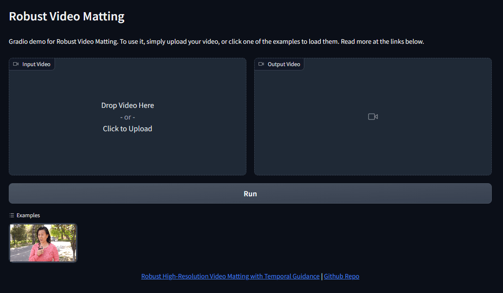

# VideoMatting

Remove the background from video files



# Setup

## Installation

Use pip to install dependencies

```bash
pip install -r requirements.txt
```

You can run the app directly by running

```bash
python app.py
```

## Docker Installation

Build dockerfile

```bash
docker build -t video-matting .
```

Then run the dockerfile

```bash
docker run -it video-matting
```

## Docker Compose

To run everything with a single call, you can use docker-compose

```bash
docker compose up
```